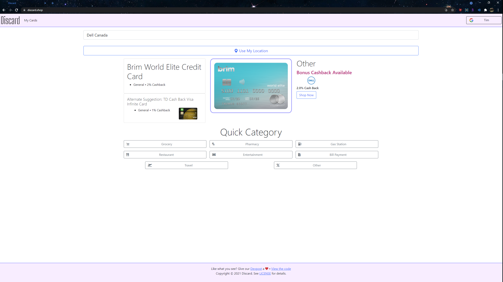

<!-- PROJECT LOGO -->
<br />
<p align="center">
  <a href="https://github.com/Ti1mmy/DisCardApp">
    
  </a>

  <h3 align="center">DisCard</h3>
  <h4 align="center"><a href="https://devpost.com/software/discard" target="_blank">Devpost Link</a></h4>
  <h4 align="center"><a href="https://discard.shop" target="_blank">» Start using DisCard!</a></h4>
  
  <p align="center">
    Worried about your wallet bulge? Remembering which credit card to use for which situation is difficult, but it doesn't have to be. <strong>DisCard</strong> missed opportunity costs so you can spend with confidence!
    <br />
    <a href="https://github.com/Ti1mmy/DisCardApp#table-of-contents"><strong>Explore the docs »</strong></a>
    <br />
    <br />
    <a href="https://youtu.be/IGw_H8sNOIQ" target="_blank">View Demo</a>
    ·
    <a href="https://github.com/Ti1mmy/DisCardApp/issues">Report Bug</a>
    ·
    <a href="https://github.com/Ti1mmy/DisCardApp/issues">Request Feature</a>
  </p>
</p>


<!-- TABLE OF CONTENTS -->
<details open="open">
  <summary><h2 style="display: inline-block">Table of Contents</h2></summary>
  <ol>
    <li>
      <a href="#about-the-project">About The Project</a>
      <ul>
        <li><a href="#built-with">Built With</a></li>
      </ul>
    </li>
    <li>
      <a href="#getting-started">Getting Started</a>
      <ul>
        <li><a href="#prerequisites">Prerequisites</a></li>
        <li><a href="#installation">Installation</a></li>
      </ul>
    </li>
    <li><a href="#usage">Usage</a></li>
    <li><a href="#roadmap">Roadmap</a></li>
    <li><a href="#contributing">Contributing</a></li>
    <li><a href="#license">License</a></li>
    <li><a href="#contact">Contact</a></li>
    <li><a href="#acknowledgements">Acknowledgements</a></li>
  </ol>
</details>


<!-- ABOUT THE PROJECT -->
## About The Project

[](https://discard.shop/)

DisCard your inefficient credit card spending!

DisCard is a web app built to help users manage their creditcards and maximize cash back rewards. Using a database of all Canadian creditcards and cash back deals from Rakuten, DisCard can tell you the best credit card to use based on your shopping needs with a sleek and responsive UI.

Simply login to DisCard with Google and add your cards to the app. You can then use the search function to find a store or directly use your location with Google Maps to find nearby stores. DisCard will then use its large database of credit cards and deals to select the best card to use from your set of cards. Just like that, you'll be set to maximize your cashback rewards!

### Built With

* [Firebase](https://firebase.google.com/)
* [Google Maps Api](https://developers.google.com/maps)
* [Bootstrap Web UI](https://getbootstrap.com/)
* [Self-Compiled Canadian Credit Card Database](https://docs.google.com/spreadsheets/d/e/2PACX-1vTbR-ImNWVYkXHN3kJJ6-jOBNGfvW0oQc26FSiGKU7F1TVXNgIL_62Y-qUf5nprVGGt1ZPRjYxpY-8G/pubhtml?gid=0&single=true)
* Stores with cashback deals scraped from [Rakuten](https://www.rakuten.ca/)

<!-- GETTING STARTED -->
## Getting Started

To get a local copy up and running follow these simple steps.

### Prerequisites

This is an example of how to list things you need to use the software and how to install them.
### Prerequisites

* Python `3.9`, `pip3`

1. Update before installing new packages

   ```sh
   sudo apt-get update
   ```
2. Check Python version

   ```sh
   python3 --version
   ```
3. If Python version < `3.9`

   ```sh
   sudo apt install python3.9
   ```
4. Validate

   ```sh
   python3.9 --version
   ```
5. Install `pip3`

   ```sh
   sudo apt-get -y install python3-pip
   ```
6. Validate

   ```sh
   pip3 --version
   ```

### Installation

1. Clone the repo
   ```sh
   git clone https://github.com/Ti1mmy/DisCardApp.git
   ```
2. `cd` into repo directory
   ```sh
   cd DisCardApp
   ```
3. Install Prerequisite Libraries
   ```sh
   pip3 install -r requirements.txt
   ```
4. Configure [Google API keys](https://cloud.google.com/docs/authentication/api-keys)
  * edit `*.html`
5. Configure [Firebase](https://firebase.google.com/)
  * edit `*.html`
6. Start Server
  * site will be accessed via `localhost:8000`
  ```sh
  cd site
  python -m http.server
  ```
7. Start Rakuten Scheduled Scrapes
  ```sh
  cd ..
  cd scrape
  cd rakuten
  python schedule.py
  ```


<!-- USAGE EXAMPLES -->
## Usage

### Navbar
At the top of every page, you'll be able to navigate between the main page, the credit card list, and info about the project. There's also an option for you to login to DisCard with Google so that you can save your cards on the app.

### Main Page
On the main page, you will be greeted by a few different options:
* Search Bar: Enter the name of the store you're looking to shop at
* Use My Location Button: Get nearby stores directly using your devices location
* Quick Category: Choose a category to find the best card suited for a broad category of stores

After using any of these options, you'll be told which card is the best to use.

### Credit Card List
This is the page where you can view and add to your set of credit cards on DisCard. Clicking on a card shows details for the card like its name and cashback details. To add a card, you can click on the search button or the manual add button.

Search:
* The search button lets you add a credit card by searching through a database of Canadian credit cards. 
* To search for a card, enter the card's name in the search bar and select an option from the list of cards. 
**TBC** [after selecting a card, you'll see the card's cashback options?]

Manual Add:
* The manual add button lets you manually add a credit card in case the search function can't provide the right card. 
* To use this function, upload a photo of the card, enter its name, and enter the cashback provided by the card for each category. 
  * You can also enter cashback for specific stores here. 
* The card will be added to your account and DisCard will consider it when finding the best card for you to use.

_For more examples, please refer to the [Demo](https://youtu.be/IGw_H8sNOIQ)_


<!-- ROADMAP -->
## Roadmap

* Native Mobile App (PWA already serves mobile app functions, but native apps are generally cleaner)
* Contactless payment setup allowing users to automatically pay using their best credit card depending on their location
* Suggest better credit cards offers to users
* Indicate cards that have excessive annual fees
* Track coupon codes
* Editing existing card entries


<!-- CONTRIBUTING -->
## Contributing

Contributions are what make the open source community such an amazing place to be learn, inspire, and create. Any contributions you make are **greatly appreciated**.

1. Fork the Project
2. Create your Feature Branch (`git checkout -b feature/AmazingFeature`)
3. Commit your Changes (`git commit -m 'Add some AmazingFeature'`)
4. Push to the Branch (`git push origin feature/AmazingFeature`)
5. Open a Pull Request


<!-- LICENSE -->
## License

Distributed under the MIT License. See `LICENSE` for more information.


<!-- CONTACT -->
## Contact

Eric Ji - [Linkedin](https://www.linkedin.com/in/eric-ji-0a8793212/) - eric868.ji@gmail.com

Katherine Li [Linkedin](https://www.linkedin.com/in/k-atherine-li/) - katherineli03.kkl@gmail.com

Timothy Zheng - [Linkedin](https://www.linkedin.com/in/timothy-zheng21/) - timothyzheng123@gmail.com

Sean Gordon

Devpost Link: [https://devpost.com/software/discard](https://devpost.com/software/discard)